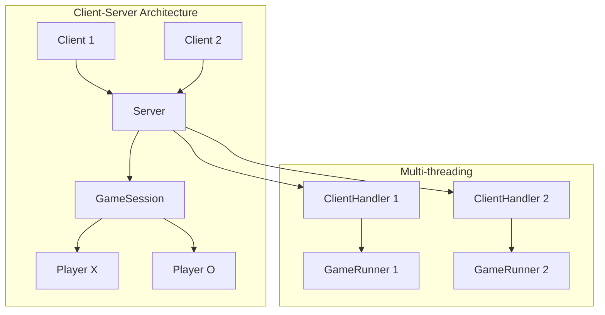
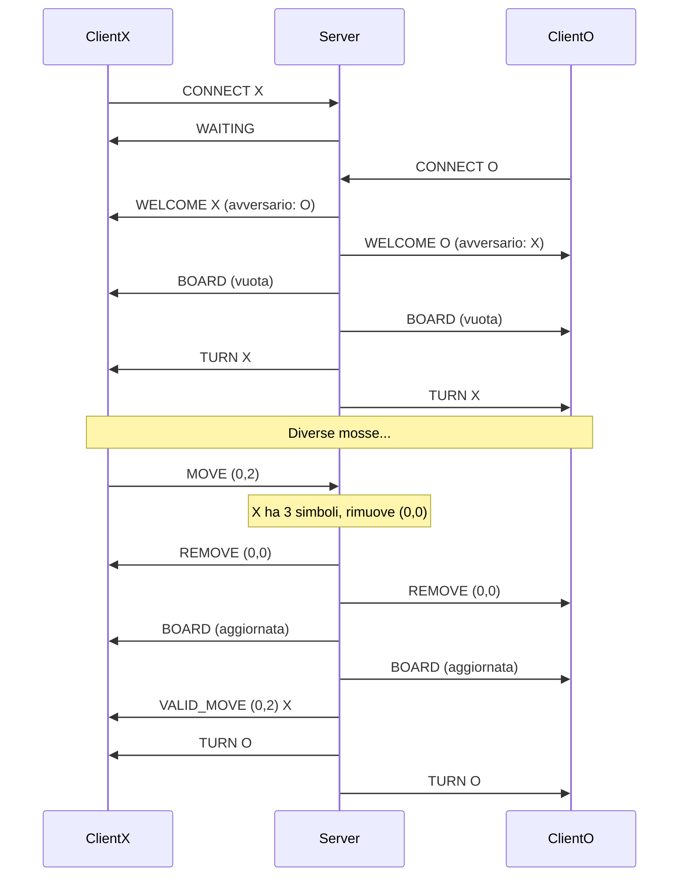

# TieLessTris 🎮

**TieLessTris** è un'applicazione Client-Server sviluppata in Java che implementa una variante innovativa del classico gioco del Tris, con la particolarità di **non poter finire in pareggio**. Ogni giocatore può avere al massimo 3 simboli sulla griglia, e quando piazza il quarto simbolo, quello più vecchio viene automaticamente rimosso.


## 📋 Indice
- [Introduzione](#introduzione)
- [Architettura](#architettura)
- [Regole del Gioco](#regole-del-gioco)
- [Installazione](#installazione)
- [Protocollo di Comunicazione](#protocollo-di-comunicazione)
- [Componenti](#componenti)
- [Multi-threading](#multi-threading)
- [Gestione Errori](#gestione-errori)
- [Test](#test)
- [Sviluppi Futuri](#sviluppi-futuri)
- [Autori](#autori)

## 🎯 Introduzione

TieLessTris è un'applicazione Client-Server che rivoluziona il classico gioco del Tris introducendo una **meccanica anti-pareggio**. Il gioco utilizza il protocollo TCP per la comunicazione e un'architettura multi-threading per gestire più partite simultaneamente.

**Caratteristiche principali:**
- ✅ Eliminazione totale dei pareggi
- ✅ Meccanica strategica dei 3 simboli massimi
- ✅ Architettura Client-Server robusta
- ✅ Multi-threading per concorrenza
- ✅ Protocollo di comunicazione personalizzato

## 🏗 Architettura

### Diagramma Architetturale


### Componenti Principali
| Componente | Descrizione | Responsabilità |
|------------|-------------|----------------|
| **TielessTrisServer** | Server principale | Gestione connessioni, creazione partite |
| **GameSession** | Gestore di partita | Logica di gioco, stato griglia, controllo vittorie |
| **Player** | Rappresentazione giocatore | Socket, username, simbolo assegnato |
| **TielessTrisClient** | Client per giocatore | Interfaccia utente, comunicazione con server |

## 🎮 Regole del Gioco

### Meccanica Innovativa
1. **Griglia 3×3** tradizionale con coordinate (0,0) a (2,2)
2. **Turni alternati** tra giocatore X e O
3. **Vincita classica**: tris orizzontale, verticale o diagonale
4. **Nuova regola anti-pareggio**:
   - Ogni giocatore può avere **massimo 3 simboli** sulla griglia
   - Al quarto simbolo, **rimozione automatica** del più vecchio
   - **Nessun pareggio possibile**

### Esempio di Flusso
```
Fase 1: Accumulo
X: (0,0) → (1,1) → (2,2)  [3 simboli]
O: (0,1) → (1,2) → (2,0)  [3 simboli]

Fase 2: Rimozione Automatica
X gioca (0,2) → RIMUOVE (0,0) (il più vecchio)
O gioca (1,0) → RIMUOVE (0,1) (il più vecchio)

Fase 3: Vittoria
... continua finché un giocatore completa un tris
```

## ⚙️ Installazione

### Prerequisiti
- **Java JDK 17** o superiore
- **Terminale/CMD** per l'esecuzione
- **Connessione di rete** (locale o internet)

### Compilazione ed Esecuzione

1. **Clona o scarica il progetto**
   ```bash
   git clone [repository-url]
   cd tielesstris
   ```

2. **Compila le classi**
   ```bash
   javac tielesstris/*.java
   ```

3. **Avvia il server** (in un terminale)
   ```bash
   java tielesstris.TielessTrisServer
   ```
   *Default: porta 12345*

4. **Avvia i client** (in terminali separati)
   ```bash
   # Client 1
   java tielesstris.TielessTrisClient
   
   # Client 2
   java tielesstris.TielessTrisClient
   ```

## 📡 Protocollo di Comunicazione

### Formato dei Messaggi

#### Client → Server
| Messaggio | Formato | Esempio | Descrizione |
|-----------|---------|---------|-------------|
| CONNECT | `CONNECT <username>` | `CONNECT Mario` | Autenticazione iniziale |
| MOVE | `MOVE <riga> <colonna>` | `MOVE 1 2` | Invia mossa |
| BOARD? | `BOARD?` | `BOARD?` | Richiesta stato griglia |
| QUIT | `QUIT` | `QUIT` | Disconnessione |
| PING | `PING` | `PING` | Test connessione |

#### Server → Client
| Messaggio | Formato | Esempio | Descrizione |
|-----------|---------|---------|-------------|
| WELCOME | `WELCOME <simbolo> <avversario>` | `WELCOME X Luigi` | Assegnazione simbolo |
| WAITING | `WAITING` | `WAITING` | Attesa secondo giocatore |
| TURN | `TURN <simbolo>` | `TURN X` | Indicazione turno |
| BOARD | `BOARD <stato>` | `BOARD X.O.X.O..` | Stato griglia |
| REMOVE | `REMOVE <riga> <colonna>` | `REMOVE 0 0` | Notifica rimozione |
| WINNER | `WINNER <simbolo>` | `WINNER X` | Annuncio vincitore |

### Diagramma di Sequenza


### Formato della Griglia
La griglia è rappresentata come stringa di 9 caratteri:
```
Indici:   0 1 2   3 4 5   6 7 8
          ↓ ↓ ↓   ↓ ↓ ↓   ↓ ↓ ↓
Stringa: "X . O   . X .   O . ."

Mappatura:
  (0,0)=X  (0,1)=.  (0,2)=O
  (1,0)=.  (1,1)=X  (1,2)=.
  (2,0)=O  (2,1)=.  (2,2)=.
```

## 🧵 Multi-threading

### Architettura Concorrente
```
┌─────────────────────────────────────────┐
│            TielessTrisServer            │
├─────────────────────────────────────────┤
│  ClientHandler 1   ClientHandler 2      │
│  (Thread)          (Thread)             │
└─────────┬─────────────────┬─────────────┘
          │                 │
          ▼                 ▼
┌─────────────────────────────────────────┐
│         Partita 1 (GameRunner)          │
├─────────────────────────────────────────┤
│  PlayerListener X   GameSession         │
│  (Thread)          (Oggetto sincronizzato│
│  PlayerListener O                       │
│  (Thread)                               │
└─────────────────────────────────────────┘
```

**Vantaggi:**
- **Scalabilità**: Gestione di multiple partite simultanee
- **Responsività**: Nessun blocco durante operazioni I/O
- **Isolamento**: Errori in una partita non influenzano le altre

## ⚠️ Gestione Errori

### Tipi di Errori Gestiti
| Errore | Messaggio | Causa | Soluzione |
|--------|-----------|-------|-----------|
| Turno errato | `ERROR Not your turn` | Mossa fuori turno | Attendere proprio turno |
| Cella occupata | `ERROR Cell already occupied` | Mossa su cella piena | Scegliere cella vuota |
| Coordinate non valide | `ERROR Invalid coordinates` | Valori fuori range 0-2 | Usare coordinate 0,1,2 |
| Partita terminata | `ERROR Game already finished` | Mossa dopo vittoria | Nuova partita |
| Connessione persa | (Disconnessione) | Network error | Riconnettersi |

### Logging del Server
```
[14:30:25.123][main] Server avviato sulla porta 12345
[14:30:30.456][ClientHandler] Nuova connessione da: /192.168.1.10:54321
[14:30:30.457][ClientHandler] Ricevuto da /192.168.1.10:54321: "CONNECT Mario"
[14:30:30.458][GameSession] Mossa rimossa: (0,0) di X
```

## 🧪 Test

### Test Case Principali
```java
// Esempio di test della logica di gioco
@Test
void testRimozioneAutomatica() {
    GameSession game = new GameSession();
    Player playerX = new Player(...);
    
    // Simula 3 mosse di X
    game.processMove(playerX, 0, 0);
    game.processMove(playerX, 0, 1);
    game.processMove(playerX, 0, 2);
    
    // Quarta mossa: dovrebbe rimuovere (0,0)
    String result = game.processMove(playerX, 1, 0);
    
    assertTrue(result.contains("REMOVE"));
    assertTrue(result.contains("VALID_MOVE"));
}
```

### Test Completati
| Test Case | Stato | Note |
|-----------|-------|------|
| Connessione multipla | ✅ | Supporto 10+ partite simultanee |
| Rimozione automatica | ✅ | Corretta gestione limite 3 simboli |
| Controllo vittoria | ✅ | Tutte le combinazioni di tris |
| Disconnessione | ✅ | Gestione graceful degradation |
| Errori input | ✅ | Validazione coordinate e turni |


## 👥 Autori

**Gruppo: Malacarne, Morelli, Tognetti**  
**Classe: 5CI**  
**Anno Scolastico: 2023-2024**

### Contributi
| Autore | Ruolo | Contributi |
|--------|-------|------------|
| **Thomas Tognetti** | Project Lead | Architettura server, protocollo |
| **Dario Malacarne** | Backend Developer | Logica di gioco, multi-threading |
| **Davide Morelli** | Client Developer | Interfaccia utente, testing |

### Licenza
```
MIT License

Copyright (c) 2024 Malacarne, Morelli, Tognetti

Permesso concesso gratuitamente a chiunque ottenga una copia
di questo software e dei file di documentazione associati...
```


---

**🎯 TieLessTris - Dove il pareggio non esiste!**  
*Un progetto didattico che dimostra competenze in programmazione concorrente, architettura software e protocolli di comunicazione.*
